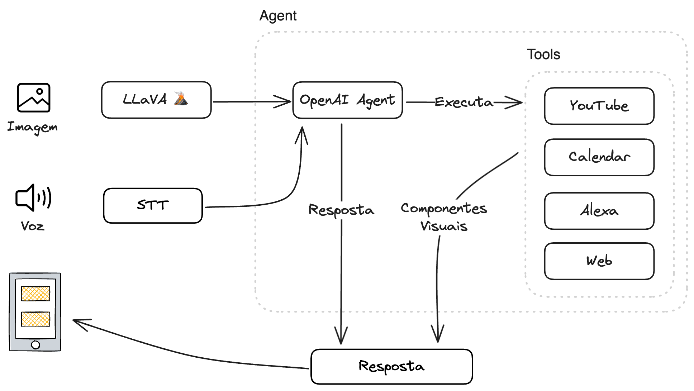

# Assistente Visual: Integrando LLMs e Dispositivos Móveis

Estamos presenciando, junto ao boom das IAs generativas, a corrida do ouro pelas soluções que tomem uma boa fatia desse "novo mercado". Até então, temos várias grandes apostas e alguns poucos winners. Um dos caminhos que me chama a atenção é o que a [Rabbit](https://www.rabbit.tech/) e a [Humane AI](https://humane.com/) estão trilhando, com desenvolvimento de <i>AI-devices</i>, uma combinação de assistente, visão computacional, "agentes" (que nesse caso são modelos LAM, Large Action Model) e interface conversacional.

O mais provocador é o posicionamento anti-aplicativos desses devices. Por que vamos precisar de novos dispositivos que "substituam" os smartphones? Essa solução não poderia ser mais um aplicativo? o que há de tão especial? Os argumentos são geralmente relacionados à experiência do usuário e de que o sistema precisa ser inteiramente integrado, possuindo até mesmo o próprio OS.

Minha ideia então foi desenvolver um assistente visual, dentro de um aplicativo, utilizando o que temos de mais acessível em termos de IAs generativas. Obviamente este aplicativo conceito não se aproxima da capacidade dos AI-devices. Em linhas gerais, um assistente visual deve (1) entender o que está sendo mostrado, (2) "pensar" e decidir o que fazer e (3) executar uma ação, este seria o tipo de interação mais simples.

Demonstrações

    <figure style="width: 33.3%;display: flex;flex-direction:column;align-items: center;">
      <video style="border-radius: 4px;" width="200" heigth="400" controls autoplay muted loop>
        <source src="../videos/vis_assist_youtube.mp4" type="video/mp4" />
      </video>
      <figcaption>Pesquisa vídeo no YouTube</figcaption>
    </figure>
    <figure style="width: 33.3%;display: flex;flex-direction:column;align-items: center;">
      <video style="border-radius: 4px;" width="200" heigth="400" controls>
        <source src="../videos/vis_assist_calendar.mp4" type="video/mp4" />
      </video>
      <figcaption>Adiciona evento ao Google Calendar</figcaption>
    </figure>
    <figure style="width: 33.3%;display: flex;flex-direction:column;align-items: center;">
      <video style="border-radius: 4px;" width="200" heigth="400" controls>
        <source src="../videos/vis_assist_math.mp4" type="video/mp4" />
      </video>
      <figcaption>Resolve problema de matemática escrito à mão</figcaption>
    </figure>

Vários modelos multimodais conseguem atender ao primeiro passo como o GPT-4V e Gemini 1.5 Pro. Uma das alternativas open source, que considerei ser mais interessante, é o [Llava](https://llava-vl.github.io/), que possui um bom desempenho em descrição detalhada e reasoning. Para a segunda e terceira etapa da interação, crei um agente com LangChain e desenvolvi algumas Tools para demonstração como busca no Youtube, pesquisa na internet, criar eventos no Google Calendar e adicionar itens a lista de compras. Para essa etapa optei por usar os modelos da OpenIA principalmente pela facilidade no uso da function calling das Tools que criei.

Por fim, a interface mais natural para esse tipo de agente é a voz, então utilizei o STT e Speech APIs do Google. A organização geral da aplicação ficou assim:

Acredito que essa solução tem uma viabilidade em aplicativos móveis, já existem em menor escala e pode ser um caminho que a indústria vai explorar com mais força uma vez que essa infusão se tornar mais performática com modelos menores e mais portáteis. Senão em smarthphones, em dispositivos multifuncionais como a Meta já abertamente vem desenvolvendo. O que resta saber é com qual facilidade esses assistentes serão adotados e se tornarão mainstream.
