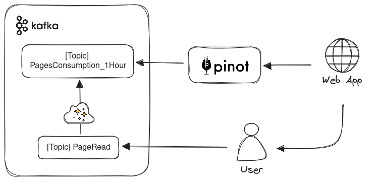
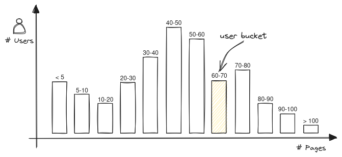

# Data Product com Apache Pinot: Personalização em “tempo real”

> Este artigo foi reescrito por IA para melhorias de escrita e correções ortográficas. O título é uma sugestão de IA com adaptações. A revisão e criação do conteúdo foi feita por humano

Estamos próximos do final do ano e com ele chega o período de um dos maiores **Data Products** já criados. Estou me referindo ao Spotify Wrapped, um produto sensacional do Spotify que oferece insights empolgantes sobre as músicas que os usuários consumiram durante o último ano. Esse é apenas um exemplo entre vários de personalização de conteúdo e experiências. Outro exemplo mais comum são as recomendações de produtos ou conteúdos (Amazon, Netflix, etc.), além de inúmeras outras aplicações, como marketing, e-commerce e afins.

Neste artigo, veremos uma técnica simples de personalização que combina conceitos de análise de dados e processamento em tempo real. O produto de dados que estamos desenvolvendo notifica o usuário de que ele é um dos usuários online que mais leu páginas de livros na última hora. Assim como o Spotify o notifica quando você é um dos 0,5% principais fãs de um artista.

<figure>
  
</figure>

Quais dados nossa aplicação precisa gerar/consumir para obter essa informação? Essa aplicação está posicionada no final de uma pipeline de dados, com o objetivo de servir diretamente aos usuários.

Aqui vou explicar como o dado "cru" é gerado e agregado. Imaginemos que cada página lida por um usuário resulta em um evento `PageRead`, que contém o ID do usuário e o Timestamp daquela leitura, entre outras informações. Esses eventos são registrados em um tópico e consumidos por um processador de stream que irá realizar a agregação (contagem) em janelas de 1 hora. O resultado dessa agregação é enviado para outro tópico chamado `PagesConsumption_1Hour`, já contendo informações mais relevantes para nossa aplicação. Mais uma vez, estamos interessados na aplicação final, então vamos assumir que as etapas de geração e agregação estão garantidas.

Gerei um script para produzir eventos para 10.000 usuários, contendo essa estrutura:

```json
{"timestamp":1700393000000,"time_window":1700339000000,"user_id":4095,"pages_read":15}
{"timestamp":1700396600000,"time_window":1700339000000,"user_id":4095,"pages_read":16}
{"timestamp":1700400200000,"time_window":1700339000000,"user_id":4095,"pages_read":17}
{"timestamp":1700403800000,"time_window":1700339000000,"user_id":4095,"pages_read":18}
{"timestamp":1700407400000,"time_window":1700339000000,"user_id":4095,"pages_read":19}
{"timestamp":1700411000000,"time_window":1700339000000,"user_id":4095,"pages_read":20}
{"timestamp":1700414600000,"time_window":1700339000000,"user_id":4095,"pages_read":21}
```

Observe que a cada página consumida, o valor de `pages_read` é incrementado. Além disso, temos dois atributos relacionados ao tempo:

- `timestamp`: momento em que o evento foi gerado (quando o usuário leu a página)
- `time_window` : a janela a qual corresponde esta agregação. No nosso caso a cada hora a janela é alterada

Esses eventos são produzidos no tópico Kafka `PagesConsumption_1Hour`. Agora, precisamos utilizar esses eventos que estão fluindo no Kafka para realizar consultas de forma eficiente, com dados sendo atualizados em tempo real. Para isso, utilizaremos o **Apache Pinot**.

## OLAP e OLTP

Apache Pinot é um datastore originalmente desenvolvido pelo LinkedIn, que pertence à categoria **OLAP** (Online Analytical Processing). Enquanto os bancos de dados de propósito geral são classificados com base em sua capacidade transacional e consistência na armazenagem de dados, os bancos de dados OLAP se destacam por sua capacidade de processar eficientemente grandes quantidades de informações com agregações complexas. No dia a dia, é mais comum utilizarmos bancos de dados **OLTP** (Online Transaction Processing), como MySQL e Postgres, enquanto os bancos de dados OLAP são usados para realizar agregações em grandes volumes de dados.

Algumas características do Apache Pinot o tornam ideal para a aplicação que estamos desenvolvendo: é muito rápido (realizei um teste de carga nesta aplicação e os resultados foram adequados), possui integração fácil com o Kafka (nativo), permite upserts eficientes (o que será necessário devido ao formato dos eventos utilizados) e fornece uma interface SQL (o que facilita bastante o consumo).

## Configurando o Schema

A instalação e utilização do Pinot é super simples. Então, vamos direto à criação do Schema que vamos utilizar. Aqui definimos quais atributos dos nossos eventos:

```json
{
  "primaryKeyColumns": ["user_id", "time_window"],
  "schemaName": "user_pages_consumption",
  "dimensionFieldSpecs": [
    {
      "name": "user_id",
      "dataType": "INT"
    }
  ],
  "metricFieldSpecs": [
    {
      "name": "pages_read",
      "dataType": "LONG"
    }
  ],
  "dateTimeFieldSpecs": [
    {
      "name": "timestamp",
      "dataType": "LONG",
      "format": "1:MILLISECONDS:EPOCH",
      "granularity": "1:MILLISECONDS"
    },
    {
      "name": "time_window",
      "dataType": "LONG",
      "format": "1:MILLISECONDS:EPOCH",
      "granularity": "1:MILLISECONDS"
    }
  ]
}
```

A definição correta do tipo de atributo ajudará nas otimizações que o Pinot fará ao executar as queries.

- **Chave Primária**: compomos a chave primária utilizando o `user_id` e o `time_window`. Isso faz sentido, já que queremos usar a feature de upsert, ou seja, cada novo evento de um usuário em uma janela de tempo deverá sobrescrever os valores existentes.
- **Dimensões**: o tipo de atributo dimensão é utilizado para seleções e agrupamentos, como em `GROUP BY` e `WHERE`
- **Métricas**: utilizado para atributos que serão provavelmente agregados (usados com `SUM` , `COUNT`, etc.) No nosso caso claramente o `pages_read` é um atributo metric.

## Criando uma Real-time table

As tabelas de tempo real são utilizadas quando o consumo é feito através de stream de dados, como é o nosso caso já que usaremos um tópico Kafka como fonte de dados. Esta é a configuração da nossa tabela:

```json
{
  "REALTIME": {
    "tableName": "user_pages_consumption_REALTIME",
    "tableType": "REALTIME",
    "segmentsConfig": {
      "replication": "1",
      "schemaName": "user_pages_consumption",
      "replicasPerPartition": "1",
      "timeColumnName": "timestamp",
      "minimizeDataMovement": false
    },
    "tenants": {
      "broker": "DefaultTenant",
      "server": "DefaultTenant",
      "tagOverrideConfig": {}
    },
    "tableIndexConfig": {
      "invertedIndexColumns": [],
      "noDictionaryColumns": [],
      "rangeIndexColumns": [],
      "rangeIndexVersion": 2,
      "autoGeneratedInvertedIndex": false,
      "createInvertedIndexDuringSegmentGeneration": false,
      "sortedColumn": [],
      "bloomFilterColumns": [],
      "loadMode": "MMAP",
      "streamConfigs": {
        "streamType": "kafka",
        "stream.kafka.topic.name": "PagesConsumption_1Hour",
        "stream.kafka.broker.list": "192.168.1.42:30992",
        "stream.kafka.consumer.type": "lowlevel",
        "stream.kafka.consumer.prop.auto.offset.reset": "smallest",
        "stream.kafka.consumer.factory.class.name": "org.apache.pinot.plugin.stream.kafka20.KafkaConsumerFactory",
        "stream.kafka.decoder.class.name": "org.apache.pinot.plugin.stream.kafka.KafkaJSONMessageDecoder",
        "realtime.segment.flush.threshold.rows": "0",
        "realtime.segment.flush.threshold.time": "24h",
        "realtime.segment.flush.threshold.segment.size": "100M",
        "security.protocol": "SASL_PLAINTEXT",
        "sasl.mechanism": "SCRAM-SHA-256",
        "sasl.jaas.config": "org.apache.kafka.common.security.scram.ScramLoginModule required username=user1 password=user1;"
      },
      "onHeapDictionaryColumns": [],
      "varLengthDictionaryColumns": [],
      "enableDefaultStarTree": false,
      "enableDynamicStarTreeCreation": false,
      "aggregateMetrics": false,
      "nullHandlingEnabled": false,
      "optimizeDictionary": false,
      "optimizeDictionaryForMetrics": false,
      "noDictionarySizeRatioThreshold": 0
    },
    "metadata": {},
    "quota": {},
    "routing": {
      "instanceSelectorType": "strictReplicaGroup"
    },
    "query": {},
    "ingestionConfig": {
      "segmentTimeValueCheck": true,
      "continueOnError": false,
      "rowTimeValueCheck": false
    },
    "isDimTable": false,
    "upsertConfig": {
      "mode": "FULL"
    }
  }
}
```

Tem muita informação aí, mas basicamente definimos como conectar com o Kafka, qual tópico e o Schema estamos utilizando. Além disso, habilitamos o `upsertConfig` . Essa configuração permitirá que a tabela seja compactada mais eficientemente, reduzindo a quantidade de documentos que serão consultados pelas queries.

## Arquitetura Resumida

Consolidando o que temos até aqui:

- 2 tópicos em Kafka utilizados para registar os eventos de consumo
- Um processo de stream que faz a agregação contando a quantidade de páginas lidas na última hora. Estamos abstraíndo esse processo aqui, existem várias ferramentas para isso: o Kafka Streams, kSQL e Flink são alguns exemplos. Como não faz parte desse artigo, vamos representar como um “passo mágico”
- Uma real-time table no Pinot, que utiliza upsert para compartar os registros de um tópico Kafka, e que será utilizada para execução de queries

<figure>
  
</figure>

Falta agora descrevermos como se comportará o último componente. A aplicação web que atende o usuário executa queries no Pinot usando um endpoint REST com sintaxe SQL. Mas qual precisamente é a abordagem para identificar se o usuário é o TOP X% leitor? e como transformamos isso em query?

## Consultando a distribuição de frequencias

O problema de definir que o usuário é o TOP X leitor consiste em encontrar o percentil em que o usuário se encontra. Ou seja, ordenamos a frequencia (número de páginas lidas) de todos os usuários de forma crescente e identificamos o percentil do usuário com base em quantas páginas ele leu.

Este processo nos daria com boa precisão a posição exata do usuário em relação aos outros. Mas, apesar de não ser tão impraticável ordenar todas as frequencias, essa aplicação precisa acertar exatamente o valor, um número razoávelmente próximo já atende bem a necessidade. Da mesma forma, o Spotify não diz que o usuário é o 0,4884782563% top fã de um artista.

Para reduzir a complexidade desse problema podemos trabalhar com histogramas. Separamos as contagens de leituras dos usuários em n buckets de tamanhos iguais (por exemplo, 10). Dessa forma extratificamos as contagens em uma estrutura mais simples que ainda representa os valores reais.

Isso significa que se Alice leu 11 páginas e Bob leu 13 para nosso propósito os dois estão no mesmo bucket, o do range 10-20.

<figure>
  
</figure>

Dessa forma fica fácil identificar qual o percentil de um usuário, encontramos qual o bucket do usuário, e somamos a quantidade de usuários antes desse bucket. Na prática:

```ts
// Sabemos que os buckets possuem tamanho 10
const userBucketIndex = Math.floor(userPagesRead / 10) - 1;

// Calculamos o total de usuários..
const allUsersCount = histogram.reduce((acc, curr) => acc + curr, 0);
// .. e quantos usuários estão antes do bucket do usuário atual
const usersBeforeCount = histogram
  .filter((_, index) => index < userBucketIndex)
  .reduce((acc, curr) => acc + curr, 0);

// Agora sim temos o percentil facilmente
const percentil = (usersBeforeCount / allUsersCount) * 100;
// Se quisermos dizer que o usuário é o TOP X%, basta ver o que falta para 100%
const topPercent = 100 - percentil;

console.log(`Você leu mais do que ${percentil}% dos usuários online! Parabéns`);
```

As queries do pinot ficam bem simples, muito similar a qualquer request em bancos de dados SQL:

**Consultamos o último registro** de consumo do usuário, com o seu ID

```sql
SELECT * FROM user_pages_consumption WHERE user_id = 7367 ORDER BY time_window DESC LIMIT 1;
```

E **obtemos o histograma com as distribuições** dos consumos de todos os usuários para a timewindow que encontramos na query anterior.

```sql
SELECT HISTOGRAM(pages_read, 0, 400, 40) FROM user_pages_consumption WHERE time_window = 1700339000000;
```

Lembra que lá atrás definimos que o `pages_read` é do tipo “métrica”? Isso está ajudando agora, pois estamos aplicando a agregação HISTOGRAM nessa variável.

## Conclusão

A ideia aqui foi explorar alguns conceitos de processamento de dados com base em um cenário de aplicação real:

- Abstraímos a complexidade do problema ao abrir mão de precisão em favor da performance da aplicação
- Exploramos os mecanismos básicos do Pinot e sua capacidade de lidar com dados de maneira escalável e performática
- Construímos uma aplicação com princípios de Data Product utilizando Kafka e Pinot

Espero que tenha conseguindo compreender bem essa aplicação. Diferentemente de outros projetos aqui no posts não criei nenhum repositório com o código utilizado, principalmente para ter um artigo mais fluido e sem muito foco em código por sí

Temos um outro artigo “[Criando um jogo interativo “real-time” com Kafka, kSQL e Vert.x](https://posts.mrmorais.com/criando-um-jogo-interativo-real-time-com-kafka-ksql-e-vert-x/)” que está relacionado a este tema em que criamos um jogo de interação real-time utilizando Kafka. Devo trazer mais artigos sobre processamento e stream de dados, assim como sobre técnicas de personalização, collaborative filtering e outros.

### Links e Recomendações

Algumas das referências para esse artigo são:

- [Documentação do Pinot](https://docs.pinot.apache.org/)
- [Histograma | Pinot](https://docs.pinot.apache.org/configuration-reference/functions/histogram)
- [Documentação do Kafka](https://kafka.apache.org/)

No início do artigo falei um pouco sobre OLTP e OLAP, são conceitos bem importantes e estão relacionados ao funcionamento interno de bancos de dados. Posso recomendar 2 livros nesse assunto que são super relevantes:

- Database Internals, de Alex Petrov
- Designing Data-Intensive Applications, de Martin Kleppmann
