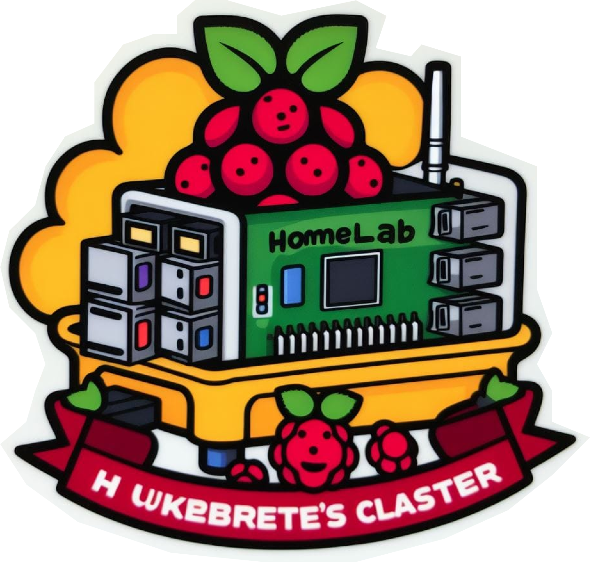
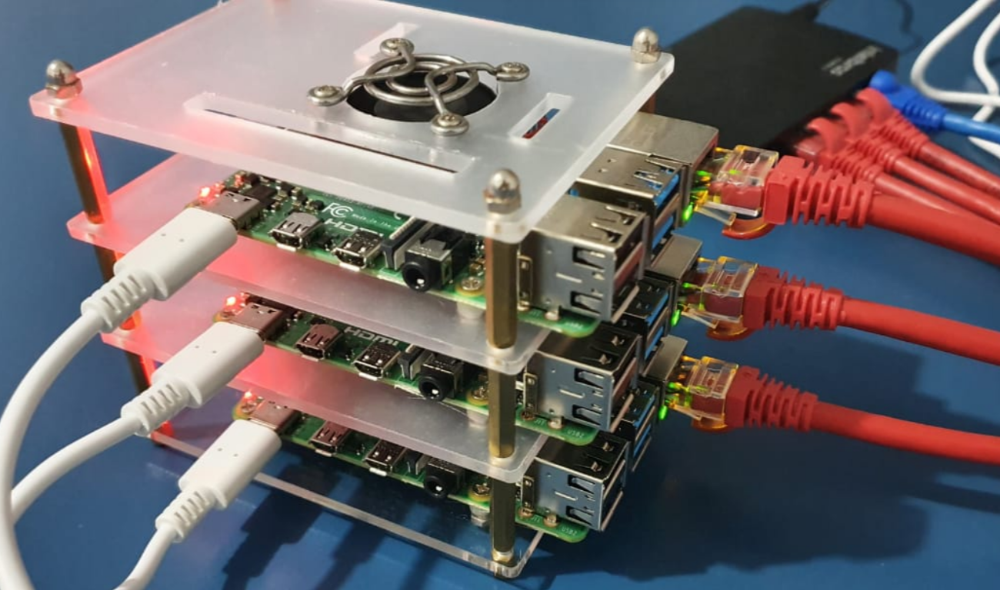

# 🤠

Status do Home Lab: verificando...

<small style="color: #919191;">Mais recentemente atualizado em 30 de novembro de 2023</small>
  

[💻 GitHub](https://github.com/mrmorais) [📝 Medium](https://medium.com/@mrmorais)

> Este é um blog pessoal sobre tópicos de tecnologia, desenvolvimento de software e outros temas.

### Últimas Publicações

- [Data Product com Apache Pinot: Personalização em "tempo real"](/data-product-com-apache-pinot-personalizacao-em-tempo-real) 30/11/2023
- [Criando um jogo interativo "real-time" com Kafka, kSQL e Vert.x](/criando-um-jogo-interativo-real-time-com-kafka-ksql-e-vert-x) 16/12/2022
- [Retorno de processamento assíncrono com Redis e GraphQL Subscriptions](/Retorno-de-processamento-assincrono-com-Redis-e-GraphQL-Subscriptions) 15/10/2022
- [Testes com Consumer-Driven Contracts](/Testes-com-Consumer-Driven-Contracts) 24/10/2019
- [(English) The Lazy World of Clojure](/The-Lazy-World-of-Clojure) 08/10/2019
- [Medindo qualidade do serviço Uber X em Natal/RN](/Medindo-qualidade-do-servico-Uber-X-em-Natal-RN) 23/09/2017
- [C++eleste - Jogo da cobrinha autônomo](/C-eleste-Jogo-da-cobrinha-autonomo) 17/06/2017
- [ECMAScript 6 e como usar](/ecmascript-6-e-como-usar) 23/03/2017
- [Aplicação real-time com socket.io (parte 1)](/Aplicacao-real-time-com-socket-io-pt-1) 22/03/2017
- [Scraprice - API de monitoramento de preços](/Scraprice-API-de-monitoramento-de-precos) 21/05/2016

### Projetos

O **FinGPT** é um AI-wrapper do ChatGPT com capacidade de fornecer insights e buscas em arquivos de releases financeiros de empresas brasileiras listadas na bolsa. A segunda versão faz acesso à internet e notícias. A IA foi uma experimentação e foi tirada do ar em meados de agosto de 2023. Você ainda pode ver [o vídeo demonstração na landing page](https://fingpt-app-git-main-mrmorais.vercel.app/) do FinGPT. Tornarei o projeto open-source em breve 🤞

Finalmente montei o meu home cluster com Raspberry Pi 4 (Model B). O setup possui basicamente: o [k3s](https://docs.k3s.io/), uma versão "light" do Kubernetes, Istio, Kiali, Zipkin, Prometheus, Grafana e ArgoCD. O cluster expõe alguns sistemas na web (de forma segura) graças à Cloudflare.

A ideia do cluster é estudar práticas de desenvolvimento cloud native usando Kubernetes e service mesh. Além de expor eventualmente alguns projetos futuros.
